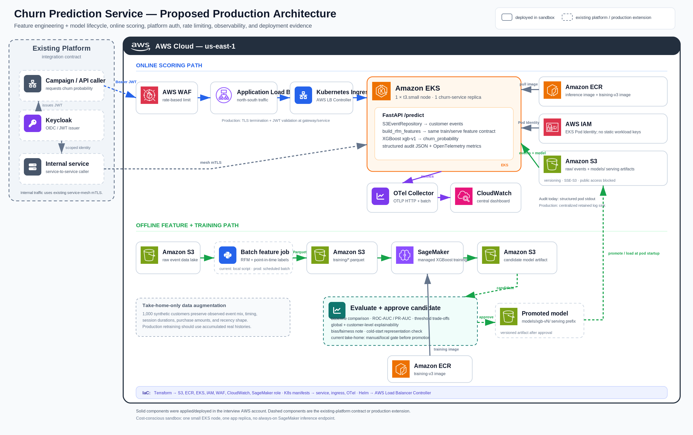
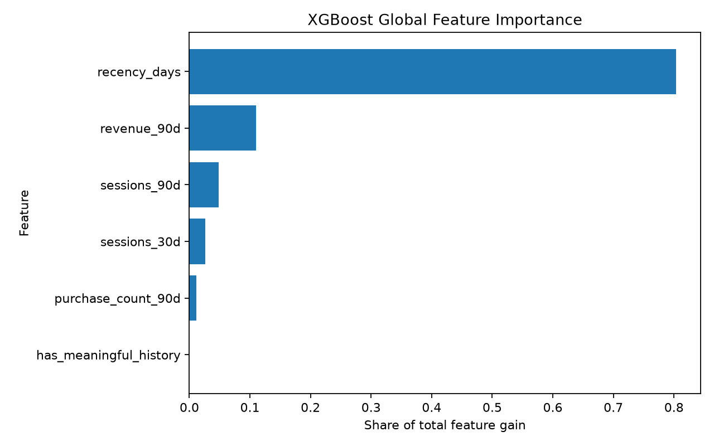
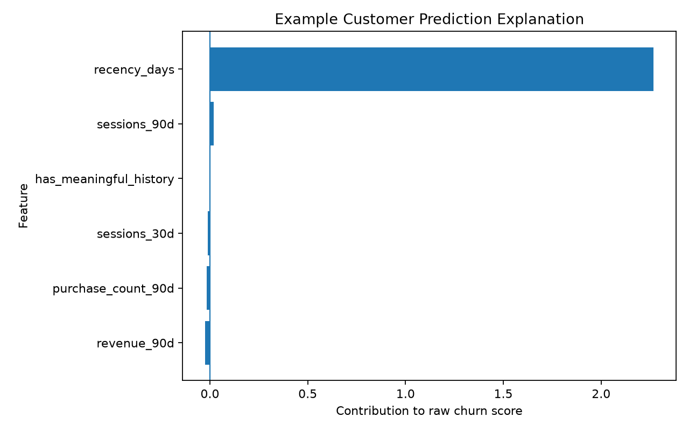
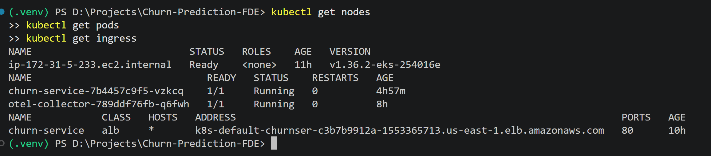
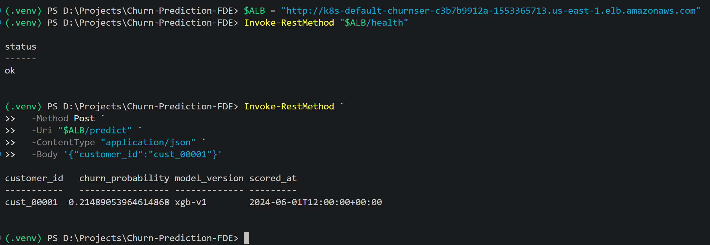
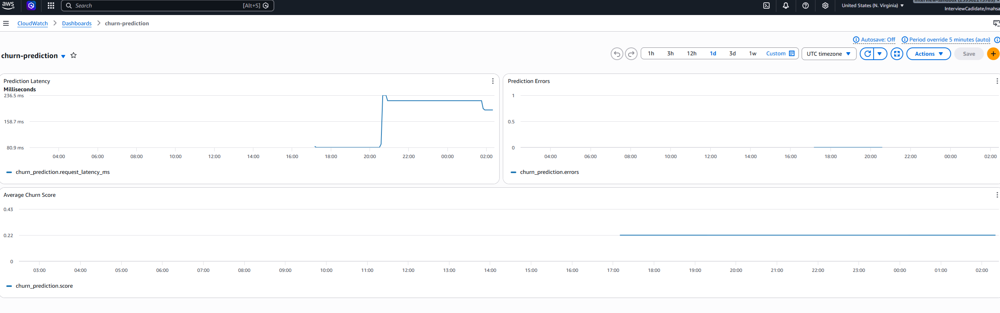
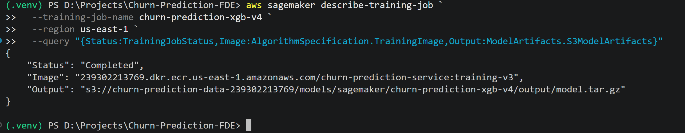

# Churn Prediction Service

A production-oriented churn scoring service built from raw customer events. The repository includes reproducible feature engineering, point-in-time churn labeling, model training and evaluation, explainability, a bias/fairness assessment, a FastAPI prediction service, AWS infrastructure, observability, and managed training with SageMaker.

The service returns a **churn probability**. Campaign owners can choose their own operating threshold based on the cost of missed churners versus unnecessary outreach.

## Implementation status

The architecture intentionally separates what is implemented from what belongs to the existing platform or is a production extension.

| Status                                                | Capability                                                                                                                                                                                                          |
| ----------------------------------------------------- | ------------------------------------------------------------------------------------------------------------------------------------------------------------------------------------------------------------------- |
| **Implemented and deployed**                          | FastAPI service on EKS, Kubernetes Ingress + AWS Load Balancer Controller, ALB, AWS WAF rate limiting, S3, ECR, IAM/EKS Pod Identity, OpenTelemetry Collector, CloudWatch metrics/dashboard, SageMaker training job |
| **Implemented in code / reproducible locally**        | Raw events → RFM features, point-in-time labels, synthetic data generation, heuristic baseline, ML model comparison, explainability, bias/fairness assessment                                                       |
| **Existing platform integration — not deployed here** | Keycloak-issued OIDC/JWT for external callers; service-mesh mTLS for service-to-service authentication                                                                                                              |

This distinction is also shown in the architecture diagram: deployed components use the main AWS flow, while existing-platform / proposed production integrations are explicitly labeled.

## Architecture



### Online scoring path

```text
External / campaign caller
        ↓
Keycloak OIDC/JWT                         existing platform; not deployed here
        ↓
AWS WAF                                  deployed; rate limiting
        ↓
Application Load Balancer                deployed
        ↓
EKS churn-service pod targets            deployed
        ↓
FastAPI /predict
        ├── load customer events from S3
        ├── apply the same RFM feature contract used for training
        ├── score with approved XGBoost model
        └── return churn_probability
```

The Kubernetes `Ingress` object is **configuration**, not a runtime proxy. The AWS Load Balancer Controller watches `k8s/ingress.yaml` and configures the ALB/target groups. Runtime traffic reaches the churn-service pod targets through the ALB.

The EKS workload accesses S3 through **EKS Pod Identity + IAM**; no static AWS credentials are embedded in the container.

Observability follows:

```text
FastAPI → OpenTelemetry → OTel Collector → CloudWatch
```

### Service-to-service authentication

**Existing platform behavior, not deployed in this AWS environment:** internal production calls use the platform's service mesh for workload authentication and mTLS. When downstream authorization requires caller identity, a scoped token can be carried in addition to workload mTLS.

The deployed service therefore demonstrates the AWS/EKS integration path, while Keycloak JWT enforcement and mesh mTLS are shown as the platform integration contract rather than claimed as implemented here.

### Offline feature and training path

There is **one S3 bucket**: `churn-prediction-data-239302213769`.

```text
raw/events.json
      ↓
point-in-time feature engineering + churn labels
      ↓
training/training_dataset.parquet
      ↓
SageMaker training job
      ↓
models/sagemaker/.../model.tar.gz     candidate model output

Current online service loads:
models/xgb-v1/churn_model.json        approved serving model
```

Feature generation, evaluation, explainability, and fairness checks are implemented as reproducible scripts. The SageMaker training job was executed successfully in AWS. **Automatic model promotion is not implemented.** A production workflow would evaluate a newly trained candidate and only then update the versioned serving model after approval.

---

## 1. Feature engineering and leakage prevention

The supplied sample contains **800 events across 80 customers**. The model uses:

| Feature                  | Definition                                                     |
| ------------------------ | -------------------------------------------------------------- |
| `recency_days`           | Days since last meaningful customer activity before the cutoff |
| `has_meaningful_history` | Whether meaningful activity exists before the cutoff           |
| `sessions_30d`           | Sessions in the previous 30 days                               |
| `sessions_90d`           | Sessions in the previous 90 days                               |
| `purchase_count_90d`     | Purchases in the previous 90 days                              |
| `revenue_90d`            | Purchase revenue in the previous 90 days                       |

`push_sent` is not considered meaningful activity because sending a message does not prove customer engagement.

For every training snapshot, features use only events **before** the cutoff. The churn label uses only the **future 60-day window** after the cutoff:

```text
past only                         cutoff                    future only
features <--------------------------|----------------------> churn label
                                                    no meaningful activity
                                                        in next 60 days
```

Snapshots are generated at multiple cutoffs, and the train/test split is grouped by `customer_id`, preventing the same customer from appearing in both sets.

Final evaluation split:

- **2,314 training rows / 582 test rows**
- **790 training customers / 198 test customers**

### Synthetic expansion

The real sample is too small for a meaningful supervised comparison, so the pipeline creates 1,000 reproducible synthetic customer histories using observed event frequencies, timing, session duration, purchase values, and recency distributions.

The synthetic generator preserves observed marginal structure but does **not** explicitly simulate a latent churn state. Model results therefore need validation on a larger real customer history before production promotion.

---

## 2. Baseline and model evaluation

### Simple heuristic baseline

A deliberately simple operational rule is used as the baseline:

> Flag a customer as churn risk when `recency_days >= 60`.

### Model comparison

All approaches use the same customer-grouped held-out set.

| Approach                |   ROC-AUC |    PR-AUC | Precision @ 0.50 | Recall @ 0.50 |
| ----------------------- | --------: | --------: | ---------------: | ------------: |
| Recency ≥ 60d heuristic |     0.438 |     0.235 |            0.186 |         0.181 |
| Logistic Regression     |     0.598 |     0.334 |            0.312 |         0.569 |
| Random Forest           |     0.646 |     0.366 |            0.360 |         0.700 |
| Gradient Boosting       |     0.760 |     0.523 |            0.613 |         0.119 |
| **XGBoost**             | **0.776** | **0.575** |        **0.680** |     **0.319** |

XGBoost was selected because it produced the strongest ROC-AUC and PR-AUC on the held-out data.

For churn/campaign selection, **PR-AUC and recall** are particularly important: a false negative means missing a customer likely to churn, while lower precision means spending campaign capacity on customers who may have remained active.

### Campaign threshold trade-off

The service returns a probability rather than enforcing a campaign threshold.

| Threshold | Precision |    Recall | Customers flagged |
| --------: | --------: | --------: | ----------------: |
|      0.20 |     0.377 | **0.875** |             63.7% |
|      0.30 |     0.519 |     0.681 |             36.1% |
|      0.40 |     0.586 |     0.469 |             22.0% |
|      0.50 | **0.680** |     0.319 |             12.9% |

A retention program that places a high cost on missed churners could use a lower threshold; a campaign with limited outreach capacity could choose a higher threshold.

The simple recency rule performs poorly on this synthetic-augmented dataset. That does not conflict with recency being important to XGBoost: tree models can use multiple recency thresholds and interactions with other behavioral signals, while the heuristic is limited to one cutoff.

---

## 3. Explainability

### Global drivers



Recency is the dominant signal used by the model, accounting for about 80% of total split gain in this training run. Recent revenue and session activity provide additional context, while purchase frequency contributes less.

For a non-technical stakeholder: **long periods without meaningful activity are the clearest warning sign of churn in this model. Recent spending and engagement help refine that risk rather than replacing inactivity as the primary signal.**

### Example prediction



For the example held-out customer, the model predicted a **78.5% churn probability**. The customer's approximately **128 days without meaningful activity** was by far the strongest signal increasing the churn prediction. Other recent engagement and purchase signals had much smaller effects.

### Global model signals

| Feature                  | Share of total split gain |
| ------------------------ | ------------------------: |
| `recency_days`           |                 **80.4%** |
| `revenue_90d`            |                     11.0% |
| `sessions_90d`           |                      4.8% |
| `sessions_30d`           |                      2.7% |
| `purchase_count_90d`     |                      1.2% |
| `has_meaningful_history` |                      0.0% |

**Stakeholder interpretation:** recent inactivity is the dominant signal used by this model. Spending and session activity provide additional context. The 80.4% figure describes the share of model split improvement attributable to recency; it does not mean recency causes 80.4% of churn.

`has_meaningful_history` has essentially zero importance because only **8 of 2,896** rows lack meaningful history, so the data is insufficient to establish predictive value for cold-start customers.

### Example customer explanation

A held-out high-risk example produced:

- customer: `syn_cust_00846`
- actual churn: `1`
- predicted churn probability: **0.785**
- `recency_days`: **127.7**

**Non-technical explanation:** this customer received a 78.5% churn probability, driven primarily by a long period of inactivity—about 128 days since meaningful activity. Other recent engagement and purchase signals had much smaller effects.

Generated explainability CSV/PNG artifacts are written under `artifacts/explainability/` when the pipeline is run.

---

## 4. Bias and fairness assessment

The supplied event data does **not** contain protected demographic attributes such as age, gender, race, ethnicity, or disability. Demographic fairness therefore cannot be measured from this data, and this project does **not** claim the model is unbiased across protected groups.

### What was checked

- Model inputs were reviewed for direct protected attributes.
- Representation of customers with limited historical activity was checked.
- All **582 held-out predictions** were reviewed for false positives and false negatives at the illustrative `0.20` threshold.
- Campaign-selection rates were checked for customers with and without recent spend because `revenue_90d` can affect access to retention incentives.

### Findings

- meaningful-history rows: **2,888**
- limited/no-history rows: **8**
- threshold `0.20`: **TP 140, TN 191, FP 231, FN 20**
- selected with recent spend: **82.5%**
- selected without recent spend: **60.8%**

The spend difference is not evidence of demographic unfairness because revenue is an explicit behavioral model input. It is still worth product review when model output controls access to discounts or other valuable benefits.

The clearer limitation is representation: cold-start customers are severely underrepresented. Before production use, I would gather more cold-start examples and, where legally and organizationally appropriate, evaluate recall, false-negative rate, false-positive rate, and calibration across relevant protected groups for auditing.

---

## 5. Prediction API

### `GET /health`

```json
{ "status": "ok" }
```

### `POST /predict`

Request:

```json
{
  "customer_id": "cust_00001"
}
```

Example response from the deployed service:

```json
{
  "customer_id": "cust_00001",
  "churn_probability": 0.21489053964614868,
  "model_version": "xgb-v1",
  "scored_at": "2024-06-01T12:00:00+00:00"
}
```

### Verify the deployed AWS endpoint

During the active AWS environment, the service was reachable through the ALB:

```powershell
$ALB = "http://k8s-default-churnser-c3b7b9912a-1553365713.us-east-1.elb.amazonaws.com"

Invoke-RestMethod "$ALB/health"

Invoke-RestMethod `
  -Method Post `
  -Uri "$ALB/predict" `
  -ContentType "application/json" `
  -Body '{"customer_id":"cust_00001"}'
```

The fixed historical `scored_at` used by this deployed demo aligns scoring with the supplied historical event window. Production scoring should use the actual scoring time/current UTC.

### Current online lookup trade-off

`S3EventRepository` reads the current raw event object and filters for the requested customer. This is sufficient for the small supplied dataset, but not a production-scale lookup design. At scale I would partition/materialize features so the online service retrieves one customer's current feature row rather than scanning a monolithic raw object.

---

## 6. AWS deployment and security

### Deployed components

| Component          | Deployed resource / behavior                                                                    |
| ------------------ | ----------------------------------------------------------------------------------------------- |
| S3                 | `churn-prediction-data-239302213769`; versioning, SSE-S3, public access blocked                 |
| ECR                | `churn-prediction-service`; inference/training images                                           |
| EKS                | `churn-prediction`; one `t3.small` managed node                                                 |
| Churn service      | `default/churn-service`                                                                         |
| Kubernetes Ingress | `default/churn-service`, `ingressClassName: alb`                                                |
| WAF                | `churn-prediction-waf`; IP-based rate rule, limit 100                                           |
| IAM                | EKS Pod Identity roles for service, OTel collector, and ALB controller; separate SageMaker role |
| OTel               | `default/otel-collector`                                                                        |
| CloudWatch         | namespace `ChurnPrediction`; dashboard `churn-prediction`                                       |
| SageMaker          | completed training job `churn-prediction-xgb-v4`                                                |

### External authentication

**Existing platform integration — not deployed here:** external callers are expected to present OIDC/JWT tokens issued by Keycloak. Production ingress/service configuration should validate those tokens before protected scoring traffic is accepted.

### Service-to-service authentication

**Existing platform integration — not deployed here:** internal workload authentication is handled by the platform service mesh using mTLS. Scoped caller tokens can be added when downstream authorization needs end-user/service identity in addition to workload identity.

### AWS workload identity

**Implemented and deployed:** the churn-service pod uses EKS Pod Identity and an IAM role restricted to the S3 prefixes it needs. The OTel collector has a separate CloudWatch role. No long-lived AWS credentials are stored in the container.

### Rate limiting

**Implemented and deployed:** AWS WAF is attached to the ALB and contains an IP-based rate rule (`limit = 100`). Production limits should be tuned to expected campaign traffic and can be supplemented with per-client quotas when caller identity is available.

### Production hardening not implemented here

- HTTPS/TLS termination with ACM
- Keycloak JWT enforcement
- service-mesh mTLS policy on the deployed workload
- private worker networking/VPC endpoints
- centralized retained audit logs
- immutable serving image tags/digests

---

## 7. Observability and auditability

The application emits OpenTelemetry metrics that the deployed OTel Collector forwards to CloudWatch:

| Metric                                | Purpose                              |
| ------------------------------------- | ------------------------------------ |
| `churn_prediction.request_latency_ms` | prediction latency                   |
| `churn_prediction.errors`             | customer-not-found / internal errors |
| `churn_prediction.score`              | monitor changes in output behavior   |

The CloudWatch dashboard shows prediction latency, prediction errors, and average churn score. A production dashboard should add latency percentiles and explicit score percentiles/buckets.

Successful predictions also emit structured audit logs containing `request_id`, `customer_id`, score, model version, scoring timestamp, and status.

---

## 8. Deployment evidence

AWS access is time-limited, so deployment evidence is committed under `docs/evidence/`.

| EKS runtime + ingress                         | Live API response                                          |
| --------------------------------------------- | ---------------------------------------------------------- |
|  |  |

| CloudWatch dashboard                                            | SageMaker training                                          |
| --------------------------------------------------------------- | ----------------------------------------------------------- |
|  |  |

Additional evidence:

- [Structured prediction audit log](docs/evidence/audit-log.png)
- [CloudWatch metrics](docs/evidence/cloudwatch-metrics.png)
- [WAF / rate-limiting association](docs/evidence/waf-rate-limiting.png)

---

## 9. Failure modes and design trade-offs

| Concern             | Current behavior                                     | Production direction                                                    |
| ------------------- | ---------------------------------------------------- | ----------------------------------------------------------------------- |
| Unknown customer    | `404`, error metric, structured log                  | retain contract; optionally add cold-start fallback                     |
| S3 unavailable      | request fails                                        | bounded retries, materialized/cached features, circuit-breaker behavior |
| Missing model       | pod startup fails                                    | health-gated rollout and previous-version rollback                      |
| Cold-start customer | explicit history flag, but very little training data | collect more examples / fallback policy                                 |
| Raw S3 lookup       | scans small raw object                               | partition/materialize online features                                   |
| Model promotion     | manual                                               | versioned approval/promotion + rollback                                 |

### Why EKS

EKS was selected because the target platform requirements emphasize Kubernetes ingress/route configuration and service-mesh authentication. For a greenfield standalone scorer, **Lambda** or **ECS/Fargate** would likely reduce cost and operational overhead. An always-on SageMaker endpoint was unnecessary because SageMaker is used here for managed training while the scoring service also owns event lookup and feature computation.

Spark/EMR, Athena, and Bedrock were not introduced because the current data volume and tabular scoring problem do not require them.

---

## 10. Reproduce locally

Python 3.11+:

```bash
python -m venv .venv
# activate the environment for your OS
pip install -e ".[dev]"

python scripts/analyze_events.py
python scripts/generate_synthetic_events.py
python scripts/compare_real_synthetic.py
python scripts/build_training_dataset.py
python scripts/train_baseline.py
python scripts/explain_model.py
python scripts/check_bias.py
python -m pytest
```

The repository has **25 passing tests** covering feature engineering, labels/datasets, synthetic generation, model training/inference, explainability, repositories, S3 behavior, and FastAPI behavior.

Run the API locally:

```bash
uvicorn churn_prediction.service:app --host 0.0.0.0 --port 8000
```

Or build the inference container:

```bash
docker build -t churn-prediction-service .
docker run --rm -p 8000:8000 churn-prediction-service
```

### Apply infrastructure

```bash
cd terraform
terraform init
terraform plan
terraform apply
```

Then configure EKS and apply the Kubernetes manifests:

```bash
aws eks update-kubeconfig --region us-east-1 --name churn-prediction
kubectl apply -f k8s/otel-collector.yaml
kubectl apply -f k8s/churn-service.yaml
kubectl apply -f k8s/ingress.yaml
```

The AWS Load Balancer Controller must be installed in the cluster before applying the ALB-backed Ingress.

---

## Repository layout

```text
src/churn_prediction/
  features.py                 raw events → RFM features
  dataset.py                  multi-cutoff point-in-time dataset
  labels.py                   60-day churn label
  synthetic.py                reproducible synthetic histories
  modeling.py                 baseline, models, metrics, thresholds
  explainability.py           global + per-prediction explanations
  service.py                  FastAPI + audit + OTel instrumentation
  runtime.py                  local/AWS composition
  inference/                  model abstraction + prediction service
  repositories/               local and S3 event repositories

scripts/
  build_training_dataset.py
  train_baseline.py
  explain_model.py
  check_bias.py
  train_sagemaker.py

k8s/
  churn-service.yaml
  ingress.yaml
  otel-collector.yaml

terraform/
  EKS, ECR, S3, IAM/Pod Identity, WAF, CloudWatch, SageMaker IAM

docs/
  architecture.png / architecture.svg
  evidence/
```
